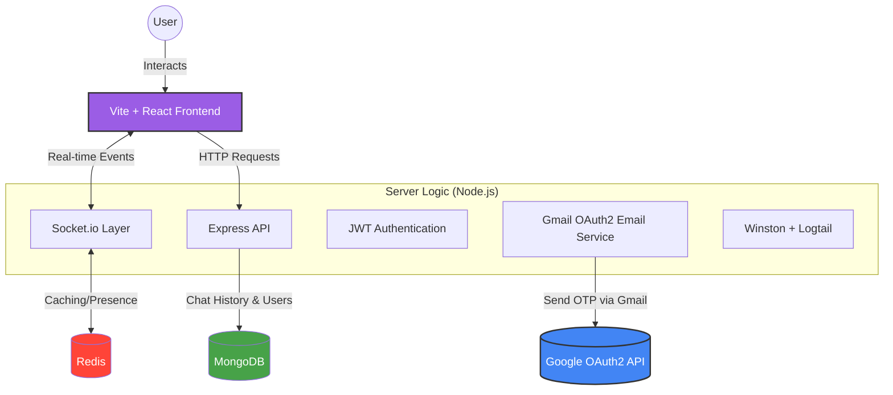

<p align="center">
  
  
</p>

<p align="center">
  Discord-style chat app • Vite + Tailwind • Express + MongoDB • Socket.IO
</p>

<p align="center">
  <a href="https://youtu.be/jZi9OCY6gsk">Watch the demo video</a>
</p>

<p align="center">
  
  
  
  
  
</p>

## What is this?

PiperChat is a Discord-style chat app with:

- Direct Messages + Servers/Channels
- Realtime updates via Socket.IO
- Presence + unread counts
- Email OTP verification
- Profile updates (display name + avatar) with Supabase storage
- Optional Redis caching (Upstash supported)
- Structured logging with Winston and optional Logtail integration

## Project structure

```text
PiperChat01/
  frontend/
    src/
    package.json
    .env.example

  server/
    src/
      config/
      lib/
      middleware/
      models/
      routes/
      services/
      socket/
    scripts/
    package.json
    .env.example
```

- `server/` → Express + MongoDB + Socket.IO API (ESM)
- `frontend/` → Vite + Tailwind UI

## System Architecture

To help contributors understand the data flow, here is the technical visualization of how PiperChat components interact:



## Quick start

### 1) Install dependencies

```bash
cd server && npm install
cd ../frontend && npm install
```

### 2) Environment variables

- Copy `server/.env.example` → `server/.env`
- Copy `frontend/.env.example` → `frontend/.env`

### 3) Run the apps

```bash
cd server && npm run dev
```

```bash
cd frontend && npm run dev
```

Frontend runs on `http://localhost:5173`  
Server runs on `http://localhost:2000`

API base URL:

```text
http://localhost:2000/api/v1
```

## Environment variables

### Server (`server/.env`)

| Key | Required | Notes |
| ---------------------------------------------------------------- | -------: | -------------------------------------- |
| `MONGO_URI` | ✅ | MongoDB connection string |
| `ACCESS_TOKEN` | ✅ | JWT secret |
| `PORT` | ❌ | Default `2000` |
| `NODE_ENV` | ❌ | `development` or `production` |
| `DEFAULT_PROFILE_PIC` | ❌ | Used on signup |
| `FRONTEND_ORIGINS` | ❌ | Comma-separated CORS whitelist |
| `MAIL_TRANSPORT` | ❌ | `auto`, `console`, `gmail_api`, `password`, or `smtp` |
| `MAIL_USER` | ❌ | Sender email address |
| `MAIL_PASS` | ❌ | Gmail App Password |
| `OAUTH_CLIENT_ID` / `OAUTH_CLIENT_SECRET` / `OAUTH_REFRESH_TOKEN` | ❌ | OAuth2 email sending |
| `SMTP_HOST` / `SMTP_PORT` / `SMTP_USER` / `SMTP_PASS` | ❌ | SMTP configuration |
| `REDIS_URL` | ❌ | Upstash URL supported (`rediss://...`) |
| `REDIS_CACHE_TTL_SECONDS` | ❌ | Default `30` |
| `UPSTASH_REDIS_URL` / `UPSTASH_REDIS_TLS_URL` | ❌ | Upstash Redis aliases |
| `OTP_TTL_MS` | ❌ | OTP expiry duration |
| `LOGTAIL_SOURCE_TOKEN` | ⚠️ | Required in production for Logtail logging |
| `LOGTAIL_INGESTING_HOST` | ⚠️ | Required in production for Logtail logging |
| `DICEBEAR_API` | ❌ | DiceBear avatar API URL |
| `DICEBEAR_STYLE` | ❌ | DiceBear avatar style |
| `SMTP_SECURE` | ❌ | Enables secure SMTP connection |
| `REDIS_HOST` | ❌ | Redis host fallback |
| `REDIS_PORT` | ❌ | Redis port fallback |
| `RATE_LIMIT_WINDOW_MS` | ❌ | Express rate-limit time window |

### Frontend (`frontend/.env`)

| Key | Required | Notes |
| ----------------------------- | -------: | -------------------------------------- |
| `VITE_URL` | ✅ | Backend URL (`http://localhost:2000`) |
| `VITE_FRONT_END_URL` | ✅ | Frontend URL (`http://localhost:5173`) |
| `VITE_SUPABASE_URL` | ❌ | For avatar uploads |
| `VITE_SUPABASE_ANON_KEY` | ❌ | For avatar uploads |
| `VITE_SUPABASE_BUCKET` | ❌ | For avatar uploads |

## API Routes

All backend APIs are mounted under:

```text
/api/v1
```

## Scripts

### Server

- `npm start` → runs production server
- `npm run dev` → runs backend with nodemon
- `npm run test:auth` → auth integration tests
- `npm run test:auth:unit` → auth unit tests
- `npm run gmail:oauth-setup` → Gmail OAuth setup helper

### Frontend

- `npm run dev` → Vite dev server
- `npm run build` → production build
- `npm run lint` → ESLint

## Logging

The backend uses Winston for structured logging.

- Development logs are printed to the console
- Production environments can optionally forward logs to Logtail
- Logtail requires:
  - `LOGTAIL_SOURCE_TOKEN`
  - `LOGTAIL_INGESTING_HOST`

## CI checks

This repository uses GitHub Actions to run automated checks on every pull
request and every push to `main`.

The workflow lives at `.github/workflows/ci.yml` and currently runs:

- Frontend dependency install with `npm ci`
- Frontend linting with `npm run lint`
- Frontend production build with `npm run build`
- Backend dependency install with `npm ci`

These checks help contributors catch broken builds, lint errors, and dependency
issues before maintainers review the pull request.

To run the same checks locally:

```bash
cd frontend
npm ci
npm run lint
npm run build
```

```bash
cd server
npm ci
npm run test:auth
npm run test:auth:unit
```

## Deployment notes

- Configure `FRONTEND_ORIGINS` with deployed frontend URLs
- Set `NODE_ENV=production`
- Use a production MongoDB connection string
- Configure Logtail variables if production logging is needed
- Prefer `MAIL_TRANSPORT=gmail_api` for production deployments